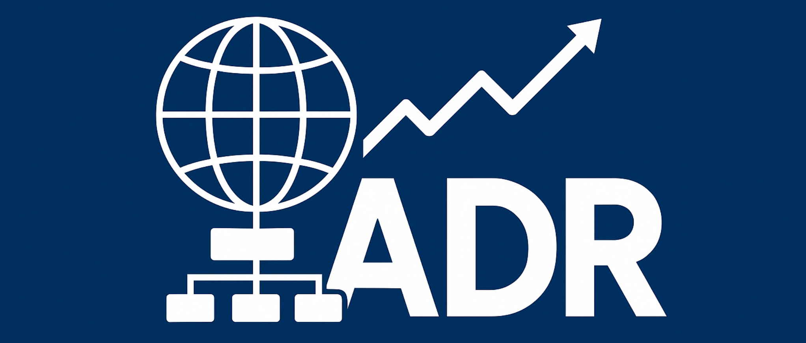
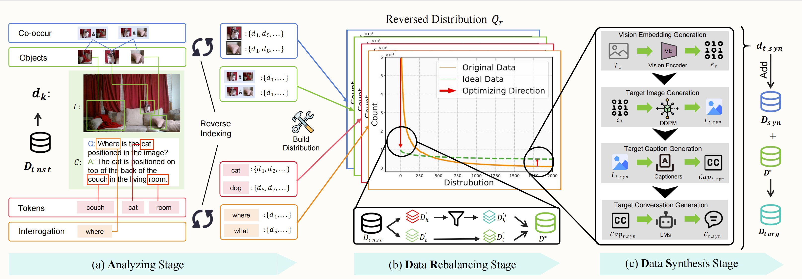

<div align="center">
  
  <h1 align="center">[CVPR 2025] VLMLT</h1>

  <a href="https://arxiv.org/abs/2503.12821">
    
  </a>
  <a href="https://vlmlt.github.io/">
    
  </a>
  <a href="https://www.youtube.com/watch?v=qPdX_mGZOqU">
    
  </a>

</div>

## From Head to Tail: Towards Balanced Representation in Large Vision-Language Models through Adaptive Data Calibration
<p align="center" width="80%">
  
</p>
<p align="center" style="font-size: 14px; color: gray;">
  The overview of our <span class="dnerf"><strong>Adaptive Data Refinement Framework (ADR)</strong></span>.
        <strong>(a)</strong> In the Analyzing Stage, we first extract<span style="color: blue;"> <em>tokens, objects, co-occurrences, and interrogations</em></span> from the training instances, then construct corresponding distribution using a reverse-indexed mapping.
        <strong>(b)</strong>  In the Data Rebalancing stage, we analyze the optimizing direction and adaptively rebalance the redundant data based on the entity distribution identified in the Analyzing stage.
        <strong>(c)</strong>  Finally, in the Data Synthesis stage, we utilize <span style="color: blue;">DDPM</span> and the latent representations of scarce image instances to synthesize the underrepresented data.

</p>

## Quick Start

### Install Dependencies
```bash
git clone https://github.com/ssmisya/VLMLT.git
cd VLMLT
pip install -e .
```

### Analyzing Stage
During the analyzing stage, we first extract tokens, objects, co-occurrences, and interrogations from the training instances. Here the analyzing stage mainly refers to the concept extractions. The entity distribution construction code are in `VLMLT/robustlmm/analysis/longTail/language_level`. You can refer to `VLMLT/robustlmm/analysis/longTail/language_level/examples` to see how to extract concepts from your own dataset.

### Data Rebalancing Stage
During the DR stage, we build the reverse indexing mapping and rebalance the redundant data based on the entity distribution identified in the analyzing stage. The code is in `VLMLT/robustlmm/data_adjustment/dr_algo`. You can refer to `VLMLT/robustlmm/data_adjustment/dr_algo/examples` to see how to rebalance your own dataset.

First, build the reverse indexing mapping:
```bash
cd VLMLT/robustlmm/data_adjustment/dr_algo
python reverse_indexing.py \
--input_path  $token_file \
--output_path ${reverse_index_prefix}/${function_type}_reverse_index.jsonl \
--function $function_type \
--id_key new_idx
```

Subsequently run Data rebalancing:
```bash
python ./reform_data_one_scope.py \
--input_dataset_file <origin-dataset-file> \
--output_file  /path/to/llava_meta_toc_p${pass_num}_a${alpha}.json \
--mode "compose_alpha" \
--compose_list ${compose_list} \
--pass_num $pass_num \
--alpha ${alpha} \
--target_model llava_pt
```

### Data Synthesis Stage

During Data Synthesis stage, we supplement the underrepresented data by utilizing DDPM and the latent representations of scarce image instances. We mainly use the scripts under `VLMLT/robustlmm/model_inference` to conduct the data synthesis. 
You can follow the instructions given in the paper and use the proper model inference scripts to synthesize the data.

## Citations

```bibtex
@inproceedings{song2025head,
  title={From head to tail: Towards balanced representation in large vision-language models through adaptive data calibration},
  author={Song, Mingyang and Qu, Xiaoye and Zhou, Jiawei and Cheng, Yu},
  booktitle={Proceedings of the Computer Vision and Pattern Recognition Conference},
  pages={9434--9444},
  year={2025}
}
```
